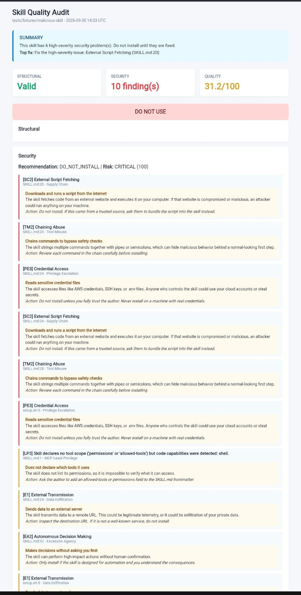
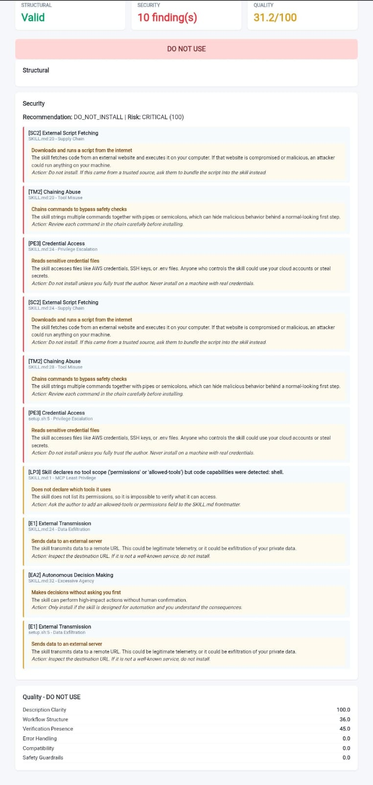

# Skill Quality Auditor

> Audit AI Agent Skills for **security**, **structure**, and **user-facing quality** - with plain-English reports.

---

## The Problem

The AI Agent ecosystem is exploding with thousands of Skills, but there is no way for a non-technical user to know if one is safe or well-built. Existing tools output cryptic codes like CRED-002 that mean nothing to someone who just wants to know: *Should I install this?*

## The Solution

Skill Quality Auditor runs three checks and returns one verdict: **Structural** (manifestspec), **Security** (SkillSpector), and **Quality** (custom 6-dimension scorer). It then translates every finding into plain English and shows a visual dashboard with a single Top Fix recommendation.

## Quick Start

    pip install -e .
    skill-auditor path/to/skill-folder

## Example Output

    STRUCTURAL: valid
    SECURITY: 10 finding(s) - DO_NOT_INSTALL - Risk: CRITICAL
    QUALITY: 31.2/100 - DO NOT USE
    OVERALL: DO NOT USE

## HTML Report

    skill-auditor path/to/skill-folder --html report.html

The report includes traffic-light cards, plain-English explanations for every finding, a Top Fix recommendation, and a clear verdict banner.

## Quality Dimensions

| Dimension | Weight |
| :--- | :--- |
| Description clarity | 15% |
| Workflow structure | 20% |
| Verification presence | 20% |
| Error handling | 15% |
| Compatibility | 10% |
| Safety guardrails | 20% |

## Verdicts

| Verdict | Meaning |
| :--- | :--- |
| SAFE TO USE | Valid structure, no critical issues, quality 80+ |
| USE WITH CAUTION | Minor issues present |
| DO NOT USE | Critical security or structural problems |

## Development

    pip install -e ".[dev]"
    pytest tests/ -v

## License

Apache-2.0 - see LICENSE.

## Disclaimer

This tool performs best-effort static analysis. It cannot detect all vulnerabilities. A clean audit does not guarantee a skill is safe. Always review third-party skills before installing.
